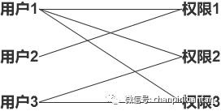
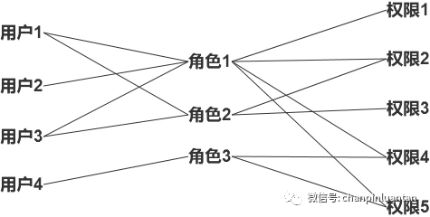
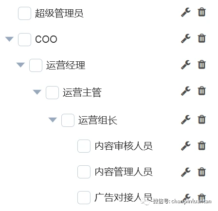

# SystemAdminPlatform

## 介绍

权限管理系统

### 1、ACL：基于用户的权限管理模型

小王是一家创业公司的产品经理，负责一款CMS系统的设计。起初，网站的所有内容都由公司唯一的运营小红负责，所以小王就对小红的账号开启了所有权限。

这种直接将权限绑定在用户账号上的方式就叫做基于用户的权限管理（ACL）。

### 2、RBAC：基于角色的权限管理模型

随着运营部门不断发展壮大，每次有新员工入职，小王都要为其单独配置权限，而且无法批量修改，十分繁琐。

同时小王发现运营部门分工明确，部分人员负责内容审核，需要为他们开启审核管理的权限；部分人员负责产出内容，需要为他们开启内容管理的权限……

这就导致小王经常会做一些重复性的工作。于是小王就想在现有的用户层上再抽象出一层——角色层，只要对角色设置权限，属于该角色的人员就自动拥有这些权限。

这种将权限绑定在角色上，再给用户账号赋予角色的方式就叫做基于角色的权限管理（RBAC），

该模型于1992年由美国国家标准与技术研究院组织开发，是目前最通用的权限管理模型，节省了很大的权限维护成本。

#### a. RBAC1：角色继承的RBAC模型

在CMS系统使用了一段时间后，小王发现了一个新问题——系统中存在的角色太多了，因为只要有权限不一样的用户加入系统，就需要新建一个角色，当用户权限分得很细的时候，甚至比ACL还繁琐，于是小王就想着手解决这一问题。

他发现角色之间存在着类似组织架构一样的上下级关系，比如COO>运营经理>运营主管>运营组长>运营人员>运营实习生，并且上级拥有下级的所有权限，同时可以额外拥有其他权限，于是他在现有的角色基础上又抽象出一层角色等级。

这种在角色中引入上下级关系的RBAC模型就叫做角色继承的RBAC模型（RBAC1），通过给角色分级，高级别的角色可继承低级别角色的权限，一定程度上简化了权限管理工作。

https://new.qq.com/rain/a/20220824A08MAQ00

权限管理，一般指根据系统设置的安全规则或者安全策略，用户可以访问而且只能访问自己被授权的资源，不多不少。

对权限做管理的系统，就是权限管理系统。

角色
操作者的身份，不同身份权限不同，看到的菜单内容也不同。常见的角色有：运营、开发者、admin等。

菜单
即用户在系统中可以看到的页面,菜单为树形结构，包含多个一级菜单，一个一级菜单包含多个二级菜单或页面，二级菜单包含多个页面。

菜单信息一般包含

权限
前端菜单/页面都需要调用后端接口，所以可以将菜单和调用的接口进行绑定，这就形成了一种关联，拥有某个菜单，便拥有了请求相关接口的权限。

关系
权限管理系统的核心是管理角色的权限。即角色、菜单、权限之间的关系。上面讲了各个组成后，这之间的关系就比较简单了

角色配置的时候和菜单进行绑定，菜单又是和接口绑定的，所以实现了角色-菜单-接口权限之间的对应关系。

前提
使用权限管理系统需要有两个前提

1. 需要有账号体系。
拥有账号体系意味着能够获取用户id，此时权限管理系统才能被使用。
2. 需要有申请流程
很多公司做权限管理系统的时候，并没有申请流程。添加新用户需管理员在后台人工添加，不但需要录入大量信息，而且容易出错，大大增加了管理员的成本。

合理的方式为，用户申请权限，系统自动录入数据，管理员审核

权限管理系统往往用于后台，虽流量不高，但也需要关注性能问题，尤其像接口权限验证，几乎每次都需要请求，此时就需要使用缓存来提高性能。

总结
按照该设计搭建的权限管理系统可以满足大部分业务需求。权限和菜单进行绑定，角色和菜单进行绑定，这种设计更直观、易理解，但也需要后台在设计时，思考好权限与角色的关系，这对后台开发者提出了一定的要求。

